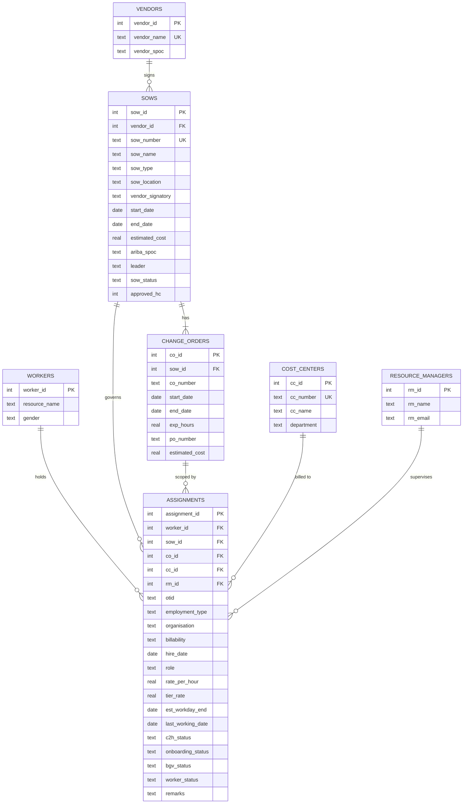

# Contingent Worker Management System — Implementation Plan

A centralized SQLite database with a Python/Flask web UI to replace four redundant Excel trackers for managing contingent (outsourced) workforce data. Multi-user, locally hosted.

---

## 1. Problem Statement

The team currently maintains **4 separate Excel trackers** for ~150 active contingent workers. The same data (names, OTIDs, SOW details, etc.) is duplicated across all four sheets. Every update requires finding and editing the same record in 4 places — tedious, error-prone, and impossible to automate on top of.

**Goal:** Build a single normalized database as the source of truth, with a web UI for daily CRUD operations, and an export engine that regenerates all 4 Excel trackers on demand for downstream teams.

---

## 2. Technology Stack

| Layer | Choice | Why |
|---|---|---|
| **Database** | SQLite 3 (via Python `sqlite3`) | Approved for install; file-based; viewable in DBeaver |
| **Backend** | Python + Flask | Lightweight web framework; pure Python; easy to learn and extend |
| **Frontend** | HTML / CSS / JS served by Flask (Jinja2 templates) | Runs in any browser on `localhost`; no extra installs; modern styling |
| **Auth** | Flask-Login + hashed passwords | Multi-user with role-based access |
| **Excel export** | `openpyxl` library | Native `.xlsx` read/write from Python |
| **DB access** | Raw SQL with parameterized queries | Teaches real SQL; safe from injection attacks |

> [!NOTE]
> **Multi-user on SQLite** — SQLite handles multiple *readers* well and serializes *writes*. With ~5–10 concurrent users this is perfectly fine. If the project scales company-wide, the schema is 100% compatible with PostgreSQL — a drop-in upgrade.

> [!NOTE]
> **Why a browser UI instead of a desktop app?**
> A Flask app running on `localhost` works in any browser with zero extra installs. The same codebase can later be deployed to a shared server with no UI rewrite. It's also much easier to style and extend with dashboards.

---

## 3. Database Schema

### 3.1 What Is Normalization?

Normalization means **splitting data into separate tables so each fact is stored exactly once**. If a vendor's name changes, you update *one* row in the `vendors` table instead of hundreds of rows across spreadsheets. Tables are linked by **foreign keys** (FK) — a column in one table that points to the primary key (PK) of another.

### 3.2 Entity-Relationship Diagram



### 3.3 Table-by-Table Breakdown

---

#### `vendors`

Stores each external vendor once.

| Column | Type | Constraint | Notes |
|---|---|---|---|
| `vendor_id` | INTEGER | PK, auto-increment | Internal ID |
| `vendor_name` | TEXT | NOT NULL, UNIQUE | e.g., "Acme Staffing" |
| `vendor_spoc` | TEXT | | Vendor's Single Point of Contact |
| `created_at` | TIMESTAMP | DEFAULT CURRENT_TIMESTAMP | Auto-set on insert |
| `updated_at` | TIMESTAMP | DEFAULT CURRENT_TIMESTAMP | Auto-set on update via trigger |

> **Why a separate table?** If the same vendor has 5 SOWs, you store the name once here and reference its `vendor_id` everywhere else. One update fixes everything.

---

#### `sows` (Statements of Work)

One row per SOW contract.

| Column | Type | Constraint | Notes |
|---|---|---|---|
| `sow_id` | INTEGER | PK, auto-increment | |
| `vendor_id` | INTEGER | FK → `vendors.vendor_id` | Which vendor owns this SOW |
| `sow_number` | TEXT | NOT NULL, UNIQUE | Business identifier, e.g., "SOW-2024-042" |
| `sow_name` | TEXT | | Called "Project Name" in IT tracker, "SOW Description" in Tech & QA tracker |
| `sow_type` | TEXT | | `'Fixed Bid'` or `'T&M'` (Time & Materials) |
| `sow_location` | TEXT | DEFAULT `'MMGBSI_LLP'` | Almost always the same value |
| `vendor_signatory` | TEXT | | Name of vendor-side signatory |
| `start_date` | DATE | | Original SOW start |
| `end_date` | DATE | | Original SOW end |
| `estimated_cost` | REAL | | Total SOW budget |
| `ariba_spoc` | TEXT | | Ariba Single Point of Contact |
| `leader` | TEXT | | Person name — almost always one person, ~3–4 records have another |
| `sow_status` | TEXT | DEFAULT `'Active'` | `'Active'` or `'Closed'` |
| `approved_hc` | INTEGER | | Approved headcount for this SOW |
| `created_at` | TIMESTAMP | | |
| `updated_at` | TIMESTAMP | | |

---

#### `change_orders`

Modifications to an SOW. Every SOW starts with at least CO_0 (created at signing). A new CO can override SOW dates and terms.

| Column | Type | Constraint | Notes |
|---|---|---|---|
| `co_id` | INTEGER | PK, auto-increment | |
| `sow_id` | INTEGER | FK → `sows.sow_id` | Parent SOW |
| `co_number` | TEXT | NOT NULL | `'CO_0'`, `'CO_1'`, etc. |
| `start_date` | DATE | | Overrides SOW start if different |
| `end_date` | DATE | | Overrides SOW end if different |
| `exp_hours` | REAL | | Expected hours under this CO |
| `po_number` | TEXT | | Each CO generates a new PO number |
| `estimated_cost` | REAL | | Budget for this CO |
| `created_at` | TIMESTAMP | | |
| `updated_at` | TIMESTAMP | | |
| | | **UNIQUE(`sow_id`, `co_number`)** | No duplicate CO numbers within the same SOW |

> **Key concept — Change Orders override SOW dates.** The original SOW dates are preserved as historical record. When querying "what is the effective end date?", the application picks the latest CO's end date.

---

#### `workers`

One row per *person*, not per engagement. If someone leaves and rejoins, they keep the same `worker_id` here but get a new `assignment` row with a new OTID.

| Column | Type | Constraint | Notes |
|---|---|---|---|
| `worker_id` | INTEGER | PK, auto-increment | Internal — never changes |
| `resource_name` | TEXT | NOT NULL | Full name |
| `gender` | TEXT | | `'M'`, `'F'`, or `'Other'` |
| `created_at` | TIMESTAMP | | |
| `updated_at` | TIMESTAMP | | |

> **Why is OTID not on this table?** Because OTIDs change when a worker leaves and returns. The OTID belongs to a specific *engagement/assignment*, not to the person. This is a critical normalization insight.

---

#### `resource_managers`

| Column | Type | Constraint | Notes |
|---|---|---|---|
| `rm_id` | INTEGER | PK, auto-increment | |
| `rm_name` | TEXT | NOT NULL | |
| `rm_email` | TEXT | UNIQUE | |
| `created_at` | TIMESTAMP | | |
| `updated_at` | TIMESTAMP | | |

---

#### `cost_centers`

| Column | Type | Constraint | Notes |
|---|---|---|---|
| `cc_id` | INTEGER | PK, auto-increment | |
| `cc_number` | TEXT | NOT NULL, UNIQUE | Business code |
| `cc_name` | TEXT | | Descriptive name |
| `department` | TEXT | | Parent department |
| `created_at` | TIMESTAMP | | |
| `updated_at` | TIMESTAMP | | |

---

#### `assignments` ★ The Central Fact Table

Each row records: *"Worker X worked under SOW Y, Change Order Z, managed by RM, billed to Cost Center, with this OTID, role, rate, and status."*

| Column | Type | Constraint | Notes |
|---|---|---|---|
| `assignment_id` | INTEGER | PK, auto-increment | |
| `worker_id` | INTEGER | FK → `workers` | The person |
| `sow_id` | INTEGER | FK → `sows` | Which SOW |
| `co_id` | INTEGER | FK → `change_orders` | Which CO within that SOW |
| `cc_id` | INTEGER | FK → `cost_centers` | Billing cost center |
| `rm_id` | INTEGER | FK → `resource_managers` | Reporting manager |
| `otid` | TEXT | | Format: `OTV1234` — validated with CHECK constraint |
| `employment_type` | TEXT | | e.g., "Contractor", "Temp" |
| `organisation` | TEXT | | |
| `billability` | TEXT | | e.g., "Billable", "Non-Billable" |
| `hire_date` | DATE | | Start date of this assignment |
| `role` | TEXT | | Job role under this SOW |
| `rate_per_hour` | REAL | | Agreed rate |
| `tier_rate` | REAL | | "Tier rate as per CA PPM" |
| `est_workday_end` | DATE | | Contract expiry date in Workday |
| `last_working_date` | DATE | | Actual last day (filled when worker exits) |
| `c2h_status` | TEXT | | `'C2H'` or `'CTH'` |
| `onboarding_status` | TEXT | | `'Pending'` or `'Completed'` |
| `bgv_status` | TEXT | | `'Pending'`, `'Completed'`, or `'Waived'` |
| `worker_status` | TEXT | DEFAULT `'Active'` | `'Active'`, `'Terminated'`, or `'Offboarded'` |
| `remarks` | TEXT | | Free-text notes |
| `created_at` | TIMESTAMP | | |
| `updated_at` | TIMESTAMP | | |

> **Why is this the star of the schema?**
> When someone moves SOWs → new assignment row. Leaves and returns → new assignment row with new OTID. Continues through a new CO → new assignment row linked to the new CO. The *worker* row stays the same; only the assignment changes.

---

#### `users` (Multi-User Authentication)

| Column | Type | Constraint | Notes |
|---|---|---|---|
| `user_id` | INTEGER | PK, auto-increment | |
| `username` | TEXT | NOT NULL, UNIQUE | Login name |
| `password_hash` | TEXT | NOT NULL | Hashed with `werkzeug.security` |
| `display_name` | TEXT | | Friendly name shown in UI |
| `role` | TEXT | DEFAULT `'admin'` | `'admin'` (full CRUD) or `'viewer'` (read-only) |
| `is_active` | INTEGER | DEFAULT 1 | 1 = active, 0 = disabled |
| `created_at` | TIMESTAMP | | |
| `updated_at` | TIMESTAMP | | |

A default admin account (`admin` / `admin`) is created on first run. Users can be added from the UI.

---

## 4. The Status System — Multi-Dimensional Design

Your 4 trackers each define "Status" differently. Instead of forcing one overloaded field, we store **each status dimension independently** and derive each tracker's status at export time.

### 4.1 Status Dimensions

| Dimension | Column | Possible Values | Lives On | Purpose |
|---|---|---|---|---|
| Worker engagement | `worker_status` | Active, Terminated, Offboarded | `assignments` | Is the person currently working? |
| SOW state | `sow_status` | Active, Closed | `sows` | Is the contract still active? |
| Onboarding | `onboarding_status` | Pending, Completed | `assignments` | Has onboarding finished? |
| Background verification | `bgv_status` | Pending, Completed, Waived | `assignments` | Has BGV cleared? |
| Contract-to-hire | `c2h_status` | C2H, CTH | `assignments` | Conversion pathway |

### 4.2 How Each Tracker's "Status" Column Is Derived at Export

| Tracker | What the Status Column Shows | How It's Built |
|---|---|---|
| **Active Contractors** | No explicit column — split into Active/Archive sheets | `worker_status = 'Active'` → active sheet; else → archive sheet |
| **IT Professional** | "Active" or "Terminated" | Directly from `worker_status` |
| **SOW Tracker Tech & QA** | "Active" or "Closed" | Directly from `sow_status` |
| **Contractors-FTE** | Composite: `"[Onboarded] [Signed] [BGV Completed]"` | Concatenate `onboarding_status`, `sow_status`, `bgv_status` |

> **Data engineering concept: Derived fields.** Instead of storing a composite string like `"Onboarded Signed Completed"`, you store each fact independently. This lets you filter by any single dimension (e.g., *"show me all workers with pending BGV"*) and assemble the composite string only when the old-format Excel export needs it.

---

## 5. Tracker → Database Column Mapping

These tables show exactly how each Excel column maps to the normalized database during export. Each tracker is exported as a **separate `.xlsx` file** with an "Active" and an "Archive" worksheet.

### 5.1 Active Contractors Consolidated Tracker

| Excel Column | DB Source |
|---|---|
| OTID Number | `assignments.otid` |
| Resource Name | `workers.resource_name` |
| Employment Type | `assignments.employment_type` |
| Department | `cost_centers.department` |
| Billable | `assignments.billability` |
| Gender | `workers.gender` |
| Hire Date | `assignments.hire_date` |
| RM | `resource_managers.rm_name` |
| Vendor | `vendors.vendor_name` |
| SOW # | `sows.sow_number` |
| Change order | `change_orders.co_number` |
| SOW name | `sows.sow_name` |
| Per hour rate | `assignments.rate_per_hour` |
| Tier rate as per CA PPM | `assignments.tier_rate` |
| SOW Start Date | `sows.start_date` |
| SOW End Date | `change_orders.end_date` (latest CO) |
| Expected hours | `change_orders.exp_hours` |
| Estimated cost | `sows.estimated_cost` |
| Role | `assignments.role` |
| Contract expiry in Workday | `assignments.est_workday_end` |
| Cost Center | `cost_centers.cc_number` |
| Cost Center Name | `cost_centers.cc_name` |
| Leader | `sows.leader` |
| Department | `cost_centers.department` |
| **Sheet split** | `worker_status = 'Active'` → Active; else → Archive |

---

### 5.2 IT Professional Consolidated SOW Tracker

| Excel Column | DB Source |
|---|---|
| S no | Row number (auto-generated at export) |
| Organization | `assignments.organisation` |
| Vendor | `vendors.vendor_name` |
| Vendor SPOC | `vendors.vendor_spoc` |
| SOW # | `sows.sow_number` |
| Change Order | `change_orders.co_number` |
| Project Name | `sows.sow_name` |
| Start Date | `sows.start_date` |
| End Date | `sows.end_date` |
| Role | `assignments.role` |
| Supplier Resource QTY | **Computed:** `COUNT(active assignments)` per SOW |
| Job title | `assignments.role` |
| Resource Name | `workers.resource_name` |
| Resource OTID | `assignments.otid` |
| Rate/Hour | `assignments.rate_per_hour` |
| From Date | `assignments.hire_date` |
| To Date | `assignments.last_working_date` OR `assignments.est_workday_end` |
| Status | `assignments.worker_status` → `'Active'` or `'Terminated'` |
| Expected Hours | `change_orders.exp_hours` |
| Cost | `change_orders.estimated_cost` |
| Manager Name | `resource_managers.rm_name` |
| Cost Center | `cost_centers.cc_number` |
| Leader | `sows.leader` |
| Department | `cost_centers.department` |
| **Sheet split** | `worker_status = 'Active'` → Active; else → Archive |

---

### 5.3 SOW Tracker Status_Tech & QA

This tracker is **SOW-centric** (one row per SOW, not per worker).

| Excel Column | DB Source |
|---|---|
| S.No | Row number (auto-generated) |
| Vendor | `vendors.vendor_name` |
| SOW Type | `sows.sow_type` |
| PO Status | `change_orders.po_number` (latest CO) |
| SOW Location | `sows.sow_location` |
| Vendor Signatory | `sows.vendor_signatory` |
| SOW No | `sows.sow_number` |
| SOW Description | `sows.sow_name` |
| Department | `cost_centers.department` (via assignments) |
| Start Date | `sows.start_date` |
| End Date | Latest `change_orders.end_date` |
| Contract Expires in | **Computed:** `latest_co_end_date - today()` in days |
| CR status | **Aggregated:** comma-joined list of all `change_orders.co_number` for this SOW |
| Cost Center | `cost_centers.cc_number` (via assignments) |
| Manager | `resource_managers.rm_name` (via assignments) |
| SOW Status | `sows.sow_status` |
| Leader | `sows.leader` |
| Department | `cost_centers.department` |
| Approved HC | `sows.approved_hc` |
| Actual HC | **Computed:** `COUNT(active assignments)` for this SOW |
| **Sheet split** | `sow_status = 'Active'` → Active; else → Archive |

---

### 5.4 Contractors-FTE Tracker

| Excel Column | DB Source |
|---|---|
| SNo | Row number (auto-generated) |
| OT ID | `assignments.otid` |
| Name | `workers.resource_name` |
| Dept | `cost_centers.department` |
| Start date | `assignments.hire_date` |
| Vendor | `vendors.vendor_name` |
| Remarks | `assignments.remarks` |
| C2H/CTH | `assignments.c2h_status` |
| Main Manager | `resource_managers.rm_name` |
| Status | **Composed:** `[onboarding_status] [sow_status] [bgv_status]` |
| **Sheet split** | `worker_status = 'Active'` → Active; else → Archive |

---

## 6. Project Structure

```
d:\Code\DB\
├── app.py                        # Flask entry point
├── config.py                     # DB path, secret key, settings
├── requirements.txt              # pip dependencies
├── database/
│   ├── schema.sql                # All CREATE TABLE + trigger statements
│   ├── seed_data.sql             # Sample data for testing
│   └── db_manager.py             # Connection helper + all CRUD functions
├── routes/
│   ├── __init__.py
│   ├── auth.py                   # Login, logout, user management
│   ├── dashboard.py              # Home page with summary stats
│   ├── vendors.py                # Vendor CRUD endpoints
│   ├── sows.py                   # SOW CRUD endpoints
│   ├── change_orders.py          # Change Order CRUD endpoints
│   ├── workers.py                # Worker CRUD endpoints
│   ├── assignments.py            # Assignment CRUD endpoints (main workflow)
│   ├── resource_managers.py      # Resource Manager CRUD endpoints
│   ├── cost_centers.py           # Cost Center CRUD endpoints
│   └── export.py                 # Excel generation + download
├── templates/                    # Jinja2 HTML templates
│   ├── base.html                 # Shared layout (sidebar nav, topbar)
│   ├── auth/
│   │   └── login.html
│   ├── dashboard.html
│   ├── vendors/
│   │   ├── list.html
│   │   └── form.html
│   ├── sows/
│   │   ├── list.html
│   │   └── form.html
│   ├── change_orders/
│   │   ├── list.html
│   │   └── form.html
│   ├── workers/
│   │   ├── list.html
│   │   └── form.html
│   ├── assignments/
│   │   ├── list.html
│   │   └── form.html
│   ├── resource_managers/
│   │   ├── list.html
│   │   └── form.html
│   ├── cost_centers/
│   │   ├── list.html
│   │   └── form.html
│   └── export/
│       └── index.html
├── static/
│   ├── css/style.css             # Custom styles
│   ├── js/app.js                 # Client-side interactivity
│   └── img/                      # Icons, logos
├── exports/                      # Generated .xlsx files land here
└── tests/
    └── test_db.py                # Automated schema + CRUD tests
```

---

## 7. Build Order (Phased Execution)

### Phase 1 — Foundation (Database + Project Skeleton)

| Step | What | Output |
|---|---|---|
| 1 | Create project folders and `requirements.txt` | Installable project structure |
| 2 | Write `schema.sql` with all tables, constraints, indexes, triggers | DDL script runnable in DBeaver |
| 3 | Build `db_manager.py` with connection helpers and all CRUD functions | Testable data access layer |
| 4 | Write `seed_data.sql` with sample data | Verifiable test dataset |

### Phase 2 — Application Core (Flask + Auth + Dashboard)

| Step | What | Output |
|---|---|---|
| 5 | Create `app.py`, `config.py`, base HTML template with navigation | Running Flask skeleton |
| 6 | Implement login/logout system (`auth.py` + `users` table) | Secured application |
| 7 | Build dashboard with summary cards (active workers, expiring SOWs, etc.) | Landing page |

### Phase 3 — CRUD UI (Entity by Entity)

| Step | What | Output |
|---|---|---|
| 8 | Vendors — list view + add/edit form | Vendor management |
| 9 | Cost Centers — list view + add/edit form | Cost center management |
| 10 | Resource Managers — list view + add/edit form | RM management |
| 11 | SOWs — list view + add/edit form (with vendor dropdown) | SOW management |
| 12 | Change Orders — list view + add/edit form (with SOW dropdown) | CO management |
| 13 | Workers — list view + add/edit form | Worker management |
| 14 | **Assignments** — main form linking worker, SOW, CO, RM, CC with all fields | Core workflow |

### Phase 4 — Excel Export

| Step | What | Output |
|---|---|---|
| 15 | Build JOIN queries that reconstruct each tracker's flat view | 4 SQL export queries |
| 16 | Write `openpyxl` export with proper headers, formatting, active/archive sheets | Export engine |
| 17 | Add download buttons in UI for each of the 4 trackers | Downloadable `.xlsx` files |

### Phase 5 — Polish & Verify

| Step | What | Output |
|---|---|---|
| 18 | End-to-end browser testing of all CRUD flows | Verified functionality |
| 19 | Compare exported `.xlsx` against original tracker format | Validated exports |
| 20 | Write README and inline code documentation | Documented project |

---

## 8. Verification Plan

### Automated Tests (`tests/test_db.py`)

- Create in-memory SQLite database from `schema.sql`
- Test **Create** — insert vendor → SOW → CO → worker → assignment; verify all exist
- Test **Read** — query assignments with JOINs; verify denormalized output is correct
- Test **Update** — modify worker name; verify change propagated
- Test **Delete** — delete assignment; verify worker still exists (no accidental cascade)
- Test **Constraint enforcement** — duplicate vendor name must fail
- Test **OTID validation** — invalid format must fail
- **Run:** `python -m pytest tests/test_db.py -v`

### Browser UI Tests

1. Navigate to `http://localhost:5000` → verify login page loads
2. Log in with default admin → verify dashboard with summary stats
3. Add a vendor → verify it appears in vendor list
4. Add a SOW linked to that vendor → verify in SOW list
5. Add a CO linked to that SOW → verify in CO list
6. Add a worker and create an assignment → verify in assignments list
7. Edit the assignment status to "Terminated" → verify it moves to archive view
8. Click "Export" for each tracker → verify 4 separate `.xlsx` files download
9. Open each `.xlsx` → verify headers match the original tracker columns

### Manual Verification (by you)

1. Open generated `.xlsx` files in Excel and compare to current trackers
2. Open the `.sqlite` database in DBeaver and browse tables
3. Test "worker leaves and rejoins" scenario: create worker → assignment → terminate → new assignment with different OTID → verify both rows exist under same worker
4. Have a colleague log in simultaneously with a second account

---

## 9. Key Data-Engineering Concepts Reference

| Concept | Where Used | Plain-English Explanation |
|---|---|---|
| **Primary Key (PK)** | Every table's `_id` column | A unique identifier for each row — like a serial number |
| **Foreign Key (FK)** | `assignments.worker_id → workers.worker_id` | A pointer: "this row belongs to *that* row in another table" |
| **Normalization** | Separate tables for vendors, SOWs, COs, etc. | Store each fact once — no copy-paste |
| **Denormalization** | Excel export JOINs everything flat | Undo normalization intentionally when consumers need a flat view |
| **Referential Integrity** | `PRAGMA foreign_keys = ON` | DB *refuses* to create an assignment pointing to a nonexistent vendor |
| **Audit Columns** | `created_at`, `updated_at` on every table | Auto-track when data was created and last modified |
| **Parameterized Queries** | All SQL uses `?` placeholders | Prevents SQL injection (malicious input altering your query) |
| **Derived Fields** | "Contract Expires in (days)", composite status | Calculated at query time, not stored — always fresh |
| **Idempotent Schema** | `CREATE TABLE IF NOT EXISTS` | Running the schema script twice doesn't break anything |

---

## 10. Future-Proofing

This architecture is designed so future automations bolt on cleanly:

| Future Feature | How It Connects |
|---|---|
| **Automated onboarding emails** | Query `assignments` for `worker_status = 'Active'` and `hire_date = today` |
| **SOW expiry alerts** | Query `change_orders` for `end_date` within 30 days |
| **Dashboard / BI integration** | SQL views can feed Power BI or any BI tool via SQLite/ODBC |
| **Multi-user server deployment** | Swap SQLite → PostgreSQL (same schema); deploy Flask to a server |
| **API layer** | Add `/api/` routes returning JSON for other systems |
| **Audit trail** | Add a `change_log` table to record who changed what and when |
